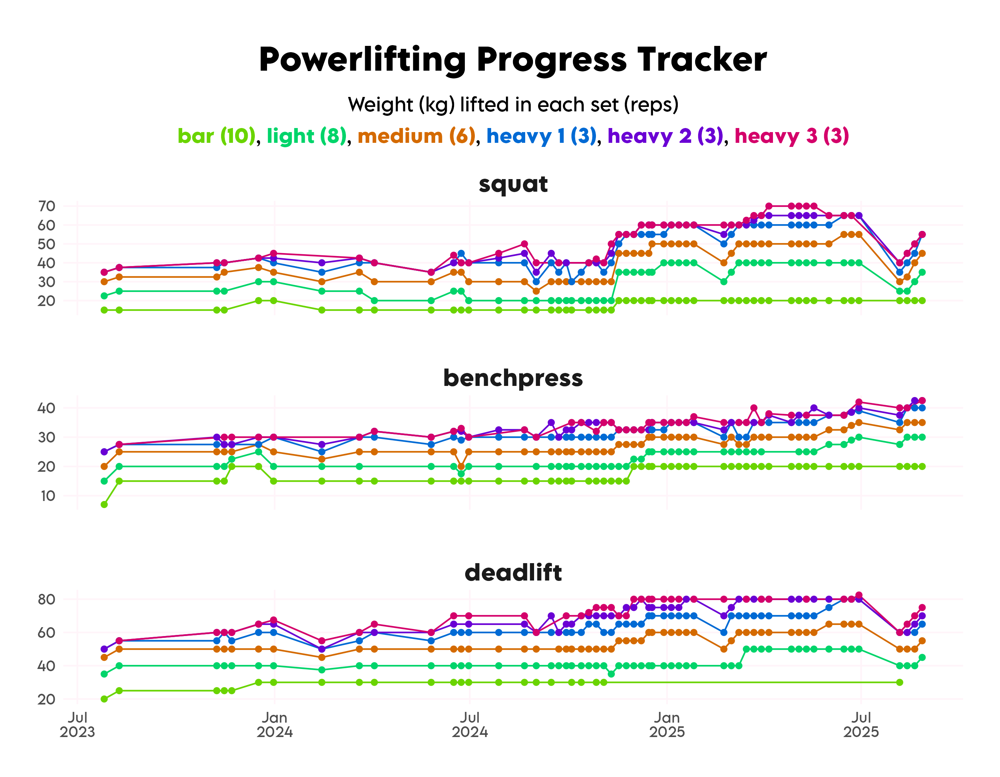

In July 2023 I started powerlifting, at my fabulous local gym, [The Project PT](https://www.theprojectpt.com). 

Around September 2024, I decided to make a concerted effort to improve.
I go once a week to powerlifting class, where we generally do the same lifts/sets/reps every time (though sometimes skip a set depending on timing and how I'm feeling that day, and sometimes the 2nd and/or 3rd heavy set may only be one or two reps, depending on if I'm pushing my weights).
It's been really gratifying to see my improvement.

Note that on the plot, the points are plotting from bar to heavy 3, 
so that if multiple sets are done at the same weight, only the colour of the last set shows, 
e.g. if only a pink point is shown for heavy 3, that means that I did all three heavy sets at that same weight.

I have had a couple of PT sessions to figure out my one-rep max on each of the lifts,
so I can calibrate what I attempt in the class (hence the jump in Nov 2024).

Here are my one-rep maxes (when I specifically set out to measure them), latest in bold:

| date       | lift       | weight (kg) | % bodyweight |
|------------|------------|-------------|--------------|
| **2025-05-23** | **squat**      | **70**          | **117**          |
| **2025-05-23** | **benchpress** | **42.5**     | **70**           |
| **2025-25-23** | **deadlift**   | **90**          | **150**          |
| 2024-11-14 | squat      | 67.5        | 113          |
| 2024-11-14 | benchpress | 37.5        | 63           |
| 2024-12-11 | deadlift   | 90          | 150          |

The 2025-05-23 one-rep max session was a disappointment. 
I thought I'd be able to lift heavier, but wasn't having a good day.
This, however, has spurred me on, and following this I decided to make yet another push to improve.
Since then, I've been training one extra time a week, doing the three lifts with a friend who is also getting into strength training.
In this sessions, I do one set of 10 reps at bar weight, one set of 8 reps at light weight, 
and three sets of 5 reps at somewhere between my medium/heavy weight. 
At the time of writing this, I've been doing this three weeks, 
and am already feeling like it's making a difference, both to my strength and confidence.

My short/medium-term goals:

- squat: 80kg
- benchpress: 50kg
- deadlift: 100kg

My long-term/lifetime goals:

- squat: 90kg
- benchpress: 60kg
- deadlift: 120kg

